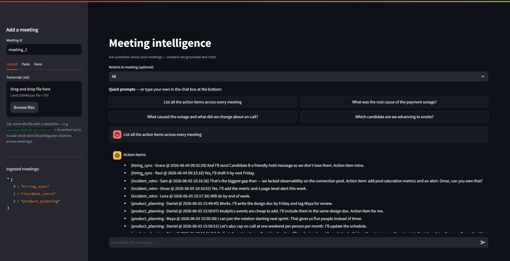

# Meeting Intelligence

A conversational assistant that answers questions about meeting transcripts:
decisions, action items, "what did we say about X", and so on. Every answer is
grounded in the transcript and cited back to the **speaker, meeting, and
timestamp**. It also handles questions that span several meetings, and it takes
both uploaded transcripts and browser voice-to-text.

This is **Option 3** (Meeting Intelligence) of the assignment. The code lives in
[`meeting-intelligence/`](meeting-intelligence/).

---

## 📹 Demo & screenshot

A short walkthrough of the app:
**[Watch the demo on Loom](https://www.loom.com/share/da7084cd4c67456dba89bd2534fe99d2)**



*Answering "List all the action items across every meeting". The aggregation
route lists every item across all three meetings, and attributes each one to its
meeting with an absolute timestamp.*

---

## Quick start (Docker)

The zero-key demo runs on fake backends (fake embedder, in-memory store, echo
LLM), so there are **no API keys and no model downloads**, and it auto-loads
three sample meetings. The image is lightweight and builds in seconds.

```bash
cd meeting-intelligence
docker compose -f docker-compose.demo.yml up --build
```

Then open the UI at **http://localhost:8501**
(the API is on http://localhost:8000, e.g. http://localhost:8000/health).

Click one of the **example prompts** (say *"List all the action items across
every meeting"*) and a grounded, cited answer shows up. In this profile the
answer text is extractive, since the echo LLM doesn't actually reason, but the
retrieval, the citations with absolute timestamps, the per-meeting brief, and the
two-stage cross-meeting grouping are all real and you can inspect them.

### Real answers (local embeddings + a hosted LLM)

For real semantic retrieval and synthesized answers, run the full image with one
API key:

```bash
cd meeting-intelligence
OPENAI_API_KEY=sk-...  EMBEDDER_BACKEND=local VECTOR_STORE_BACKEND=chroma \
  LLM_BACKEND=openai  docker compose up --build
# UI on http://localhost:8501, API on http://localhost:8000
```

### Without Docker

See [`meeting-intelligence/README.md`](meeting-intelligence/README.md#quick-start)
for the local Python setup, the tests, and the retrieval eval harness.

---

## Documentation

- **[`meeting-intelligence/README.md`](meeting-intelligence/README.md)** is the
  main write-up. It covers the RAG/LLM decisions and trade-offs, chunking,
  embeddings, the two-stage cross-meeting retrieval, guardrails, observability,
  what I'd need to productionise it, the engineering standards I followed, and how
  I used AI tools. **Start there for the reasoning.**
- **[`meeting-intelligence/docs/architecture.md`](meeting-intelligence/docs/architecture.md)**
  has the architecture diagrams (Mermaid): the two runtime phases, the dual-input
  flow, the layer boundaries, the domain model, and the two-stage query
  lifecycle. The root [`architecture.md`](architecture.md) just points here so
  there isn't a second copy to drift out of sync.

---

## What it does (at a glance)

- **Ingests** transcripts (`[HH:MM:SS] Speaker: text` or plain `Speaker: text`)
  or browser voice input, and **redacts** leaked PII before anything is stored.
- **Anchors** each turn to an absolute datetime (`meeting_start + offset`) so
  citations stay unambiguous across meetings.
- **Extracts** decisions and action items at ingestion, so "list the action
  items" or "summarise" is answered by enumeration rather than top-k search.
- **Retrieves in two stages**: first it picks the meeting(s) that matter and
  injects each one's brief, then it digs out the exact hits along with the turns
  before and after them.
- **Won't hallucinate**, and **shows its work** (the retrieved chunks and their
  scores).

Have a look at the [main README](meeting-intelligence/README.md) for the full
picture.
