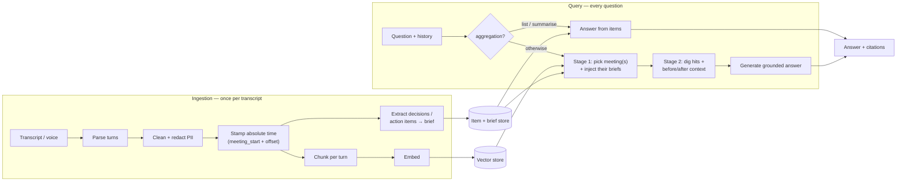
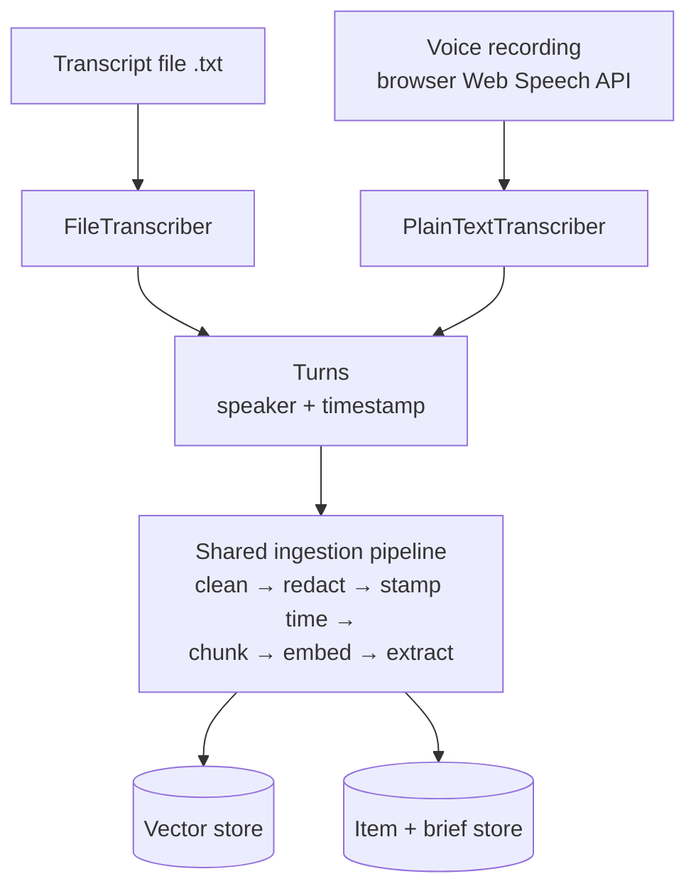
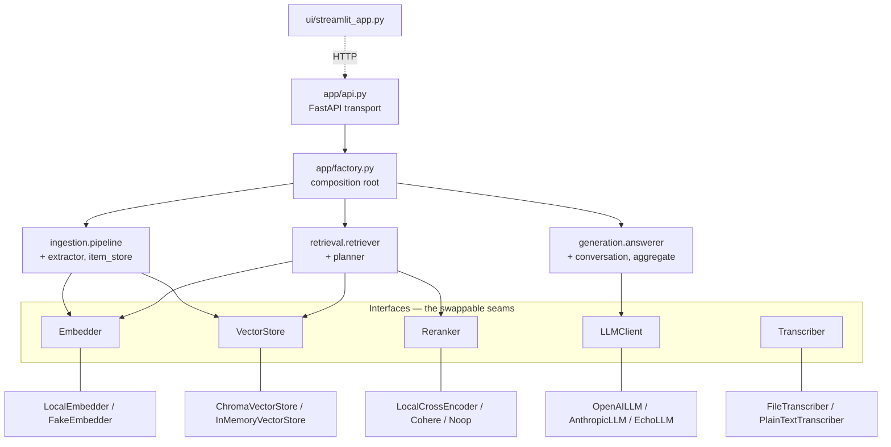
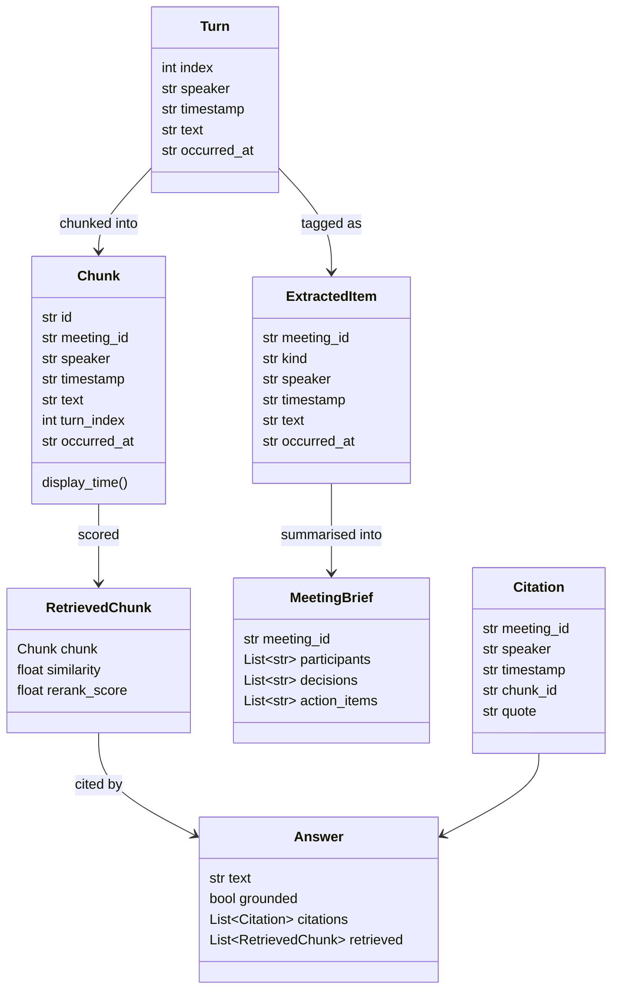
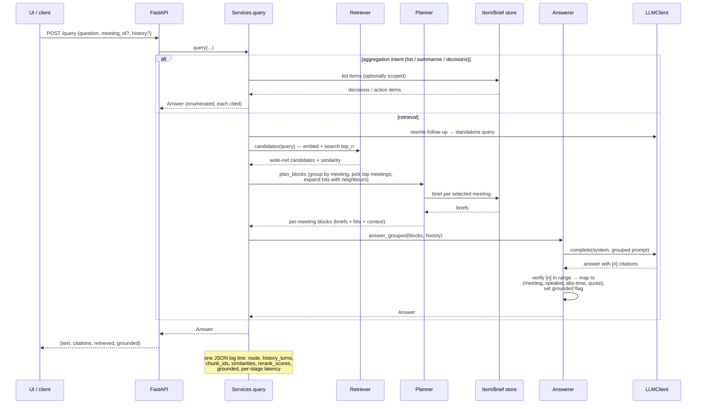

# Architecture

The fuller picture behind the summary in the
[project README](../README.md). It covers the two runtime phases, how the two
input sources converge, the layer boundaries that keep the system swappable, the
domain model, and the lifecycle of a single query.

Diagrams are [Mermaid](https://mermaid.js.org/) and render on GitHub.

---

## 1. The two phases

The system has one write path and one read path. Ingestion runs **once per
transcript**; the query path runs **on every question**. They meet at the vector
store and the item/brief store.

The design rule: nothing sensitive crosses into the store. `Clean + redact` runs
*before* `Embed` and before extraction, so raw PII never reaches the store or the
LLM.

---

## 2. Two inputs, one pipeline

Uploaded files and browser voice are different at the edge but identical
everywhere after the transcriber seam. A file already carries speaker +
timestamp structure; voice does not, so it is normalised into the same
`Turn` shape (single speaker, synthesised timestamps) before anything shared
runs.

**Diarisation caveat.** Browser STT cannot tell speakers apart, so voice input is
attributed to one speaker. True "who spoke when" needs the raw waveform and a
speaker-embedding model (VAD → x-vectors → clustering, e.g. pyannote), which is
impractical client-side. The intended fix is a server-side transcription backend
(Deepgram / AssemblyAI / Whisper+pyannote) that returns diarised turns and drops
in at the `Transcriber` seam — see §4.

---

## 3. Layers and dependencies

Every layer depends only on the interfaces in `app/interfaces.py`, never on a
concrete vendor. `app/factory.py` is the single composition root that reads
config and picks implementations.

Reading this top to bottom: the transport and orchestration layers know nothing
about MiniLM, Chroma, or Cohere — they hold interface references. The concrete
classes on the bottom row are interchangeable, and which one is live is a config
flag resolved in the factory. The UI is a pure HTTP client and never imports the
core, so it could be replaced wholesale without touching the pipeline.

The item/brief store (`ingestion.item_store`) holds the per-meeting decisions,
action items, and brief derived at ingestion. It sits beside the vector store
because those records are used by *enumeration* (aggregation answers) and as
whole-meeting context, not by similarity search.

---

## 4. Swapping an implementation

Because the seams are interfaces, every realistic upgrade is "write a new class,
flip a flag." No pipeline code changes.

| Seam | Default (this build) | Drop-in upgrade | Config flip |
|---|---|---|---|
| `Embedder` | local multilingual MiniLM | hosted embeddings | `EMBEDDER_BACKEND` |
| `VectorStore` | Chroma (in-process) | pgvector / Qdrant | `VECTOR_STORE_BACKEND` |
| `Reranker` | `noop` (measured: the local cross-encoder didn't help this corpus) | local cross-encoder / Cohere | `RERANKER_BACKEND` |
| `LLMClient` | `echo` (extractive) | OpenAI / Anthropic | `LLM_BACKEND` |
| `Transcriber` | browser Web Speech API | Deepgram / Whisper+pyannote (diarised) | (new backend) |

The `fake` / `memory` / `echo` implementations exist specifically so the whole
system — and its tests — run with zero API keys and no model downloads. That is
what CI and the [zero-key demo](../docker-compose.demo.yml) use.

---

## 5. Domain model

The pipeline speaks in these types regardless of which backends are wired in.
Keeping them vendor-free is what lets the seams stay swappable.

`Chunk.id` is a content hash of `(meeting_id, turn_index, part, text)`. That is
what makes ingestion idempotent: re-ingesting the same transcript produces the
same ids, so the store upserts instead of duplicating.

`occurred_at` is the absolute wall-clock time (`meeting_start + relative
offset`), set when the meeting's start is known (from the file name or an
explicit `started_at`). `display_time()` returns it when present and falls back
to the relative timestamp otherwise, so citations are unambiguous across
meetings. `HistoryTurn` (role, content) carries prior conversation turns for
follow-up resolution.

---

## 6. Query lifecycle

What happens on a single `POST /query`, and where the routing, guardrails, and
observability sit.

Two guardrail layers appear in the Answerer step: the grounding prompt (answer
only from the numbered excerpts, cite `[n]`, never cite the brief/history, or say
"Not discussed in the transcript"), and the output check that drops out-of-range
citations and flags an answer as ungrounded if nothing valid was cited. The
retrieval scores and stage latencies returned in `retrieved` are surfaced in the
UI and logged, so "why did it answer that?" is always inspectable.

---

## 7. Where this goes in production

Summarised from the README's productionising section: the API is already
stateless and config-driven, so scaling is more replicas behind an autoscaler;
Chroma swaps to managed pgvector/Qdrant via the `VectorStore` seam (which also
becomes the natural home for the item/brief store); embedding moves off the
request path onto a queue (ingestion is idempotent, so retries are safe); secrets
move to a manager; and the structured logs feed a tracing/metrics backend with
alerts on grounded-rate and latency, gated in CI by the eval harness's retrieval
metrics.
